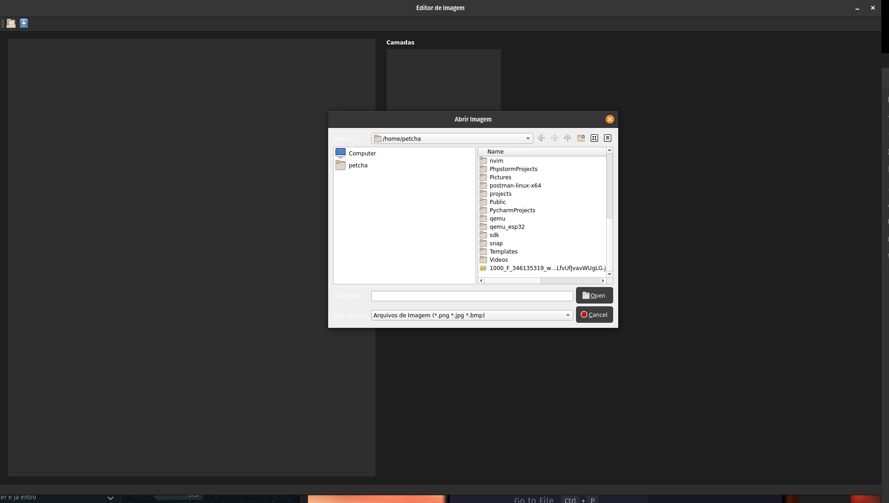

# Editor de Imagens

## Descrição

O Editor de Imagens é uma aplicação desenvolvida em Python que permite aos usuários editar imagens de forma intuitiva e eficiente. Utilizando a biblioteca PyQt5 para a interface gráfica e OpenCV para o processamento de imagens, o editor oferece funcionalidades avançadas como gerenciamento de camadas, aplicação de filtros (Blur e Gaussian Blur), e suporte a desfazer ações (undo).

## Funcionalidades

Abrir Imagens: Suporte para formatos .png, .jpg, .bmp.
Gerenciamento de Camadas: Adicionar, remover, mover e alternar a visibilidade das camadas.

## Aplicação de Filtros:
    - Blur: Aplicação de desfoque simples com seleção do tamanho do kernel.
    - Gaussian Blur: Aplicação de desfoque gaussiano com seleção do tamanho do kernel e valor de sigma.

